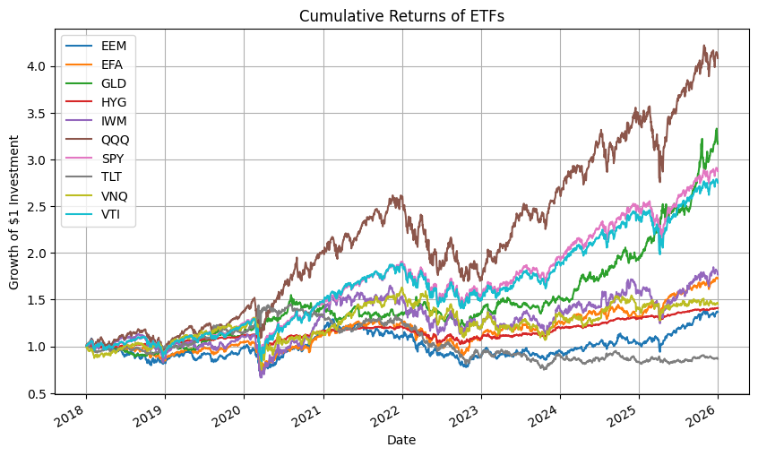
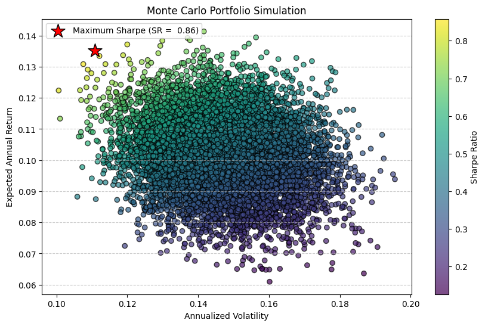
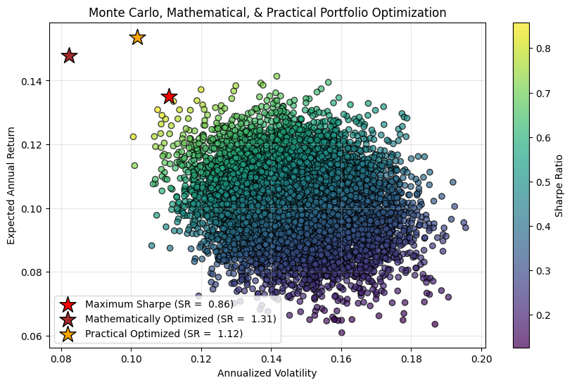
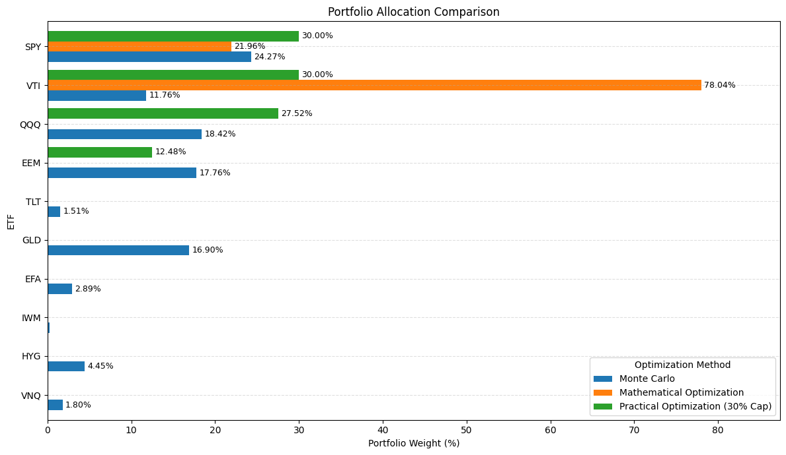
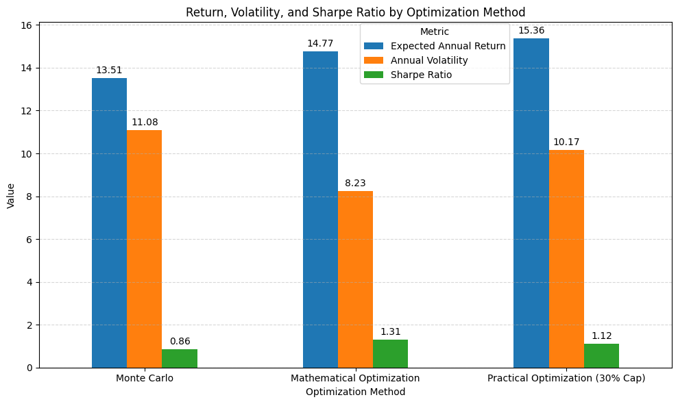

# ETF Portfolio Optimization Using Historical Market Data

Comparing Monte Carlo Simulation, Mathematical Optimization, and Practical Portfolio Construction.

Python project analyzing historical ETF market data to optimize investment portfolios using Monte Carlo simulation and mathematical optimiation techniques.

---

## 📊 Project Presentation

View the presentation summarizing the project methodology, optimization techniques, and key findings.

**Presentation:** [ETF Portfolio Optimization Presentation](presentation/ETF_Portfolio_Optimization_Presentation.pdf)

---

## Project Overview

This project explores whether historical exchange-traded-fund (ETF) market data can be used to construct anoptimized investment portfolio. Using Python, historical price data was analyzed to compare three portfolio optimization approaches: Monte Carlo simulation, unconstrained mathematical optimization, and a practical optimization model with allocation constraints. Each portfolio is evaluated using expected annual return, volatility, diversification, and Sharpe Ratio to determine which optimization method provides the best balance between risk, return, and diversification.

---

## Business Problem

Investors face the challenge of allocating capital across multiple ETFs while balancing expected returns and investment risk.

**Business Question**

> Can historical ETF market data be used to construct an optimized portfolio that maximizes risk-adjusted returns while maintaining practical diversifaction?

---

## Project Objective

The objective of this project is to:

- Collect and analyze historical ETF price data
- Evaluate portfolio risk and expected returns
- Compare multiple portfolio optimizatoin techniques
- Recommend a practical ETF allocation based on historical performance

---

## Dataset

Historical daily adjusted closing prices were collected using the Yahoo Finance API through the 'yfinance' Python library.
Example ETFs include:

- SPY
- VTI
- QQQ
- EEM
- TLT
- GLD
- EFA
- IWM
- HYG
- VNQ

---

## Tools & Technologies

- Python
- Pandas
- NumPy
- SciPy
- Matplotlib
- yfinance
- Google Colab
- Github

---

## Methodology

The project followed the following workflow:

### 1. Data Collection

- Downloaded historical ETF price data using Yahoo Finance
- Combined data into a single dataset

### 2. Data Quality Assessment

Performed data validation including:

- Missing value detection
- Duplicate direction
- Data type verification
- Summary statstics

### 3. Exploratory Data Analysis

- Daily returns
- Cumulative returns
- Correlation analysis
- Return distributions

### 4. Monte Carlo Simulation

Generated approximately 10,000 randomly weighted portfolios to estimate:

- Expected annual returns
- Annual volatility
- Sharpe Ratio

The portfolio with the highest Sharpe Ratio was identified

### 5. Mathematical Optimization 

Used SciPy's Sequential Least Squares Programming (SLSQP) optimizer to maximize the portfolio Sharpe Ratio.

### 6. Practical Portfolio Optimization

Added a maximum allocation constraint of 30% per ETF to improve diversification and create a more realistic inestment portfolio.

### 7. Performance Comparison

Compared all optimization methods using:

- Expected return
- Annual volatility
- Sharpe Ratio
- Portfolio allocation

---
## Results

The unconstrained mathematical optimization achieved the highest Sharpe Ratio but concentrated investments in a small number of overlapping ETFs.
Introducing allocation constraints produced a more diversified portfolio while maintaining competitive risk-adjusted performance.
Based on these findings, the constrained optimization model provides the most practical investment recommendation.

---
# Key Visualizations

## Cumulative ETF Returns



This chart illustrates the historical cumulative performance of the selected ETFs over the analysis period. It provides an initial view of return trends before portfolio optimization is applied.

---
## Monte Carlo Portfolio Simulation



10,000 randomly weighted portfolios were simulated to evaluate expected annual return, annual volatility, and Sharpe Ratio. The highlighted portfolio represents the highest Sharpe Ratio identified through the simulation.

---

## Efficient Frontier and Optimal Portfolios



This visualization compares the highest-Sharpe portfolio from the Monte Carlo simulation with portfolios generated through mathematical optimization and a practical optimization model using a 30% allocation cap.

---
## Portfolio Allocation Comparison



This chart compares ETF weight allocations across the Monte Carlo, mathematical optimization, and practical optimization methods, highlighting differences in diversification and portfolio concentration.

---
## Performance Comparison



Expected annual return, annual volatility, and Sharpe Ratio are compared across all optimization methods to evaluate their relative risk-adjusted performance. 

Key Finding: While the unconstrained mathematical optimization achieved the highest Sharpe Ratio, it produced a concentrated allocation. The practical optimization maintained strong risk-adjusted performance while improving diversification, making it the preferred recommendation.

---

## Repository Structure
```
ETF-Portfolio-Optimization/

│
├── README.md
├── ETF_Portfolio_Optimization.ipynb
├── images/
│   ├── cumulative_returns_of_etfs.png
│   ├── monte_carlo_correlation_heatmap.png
│   ├── monte_carlo_mathematical_practical_correlation_heatmap.png
│   ├── allocation_comparison.png
│   └── performance_comparison_by_optimization_method.png
│
└── presentation/
    └── ETF_Portfolio_Optimization_Presentation.pdf
```

---

## Future Improvements

Potential enhancements include:

- Incorporating transaction costs
- Accounting for taxes
- Including additional performance metrics such as Sortino Ratio and Maximum Drawdown
- Expanding the ETF universe
- Testing rolling time windows
- Building an interactive dashboard using Streamlit or Power BI

---

## Key Skills Demonstrated

- Portfolio Optimization
- Monte Carlo Simulation
- Financial Modeling
- Risk Analysis
- Data Cleaning
- Data Validation
- Exploratory Data Analysis
- Python Programming
- Data Visualization
- Statistical Analysis

---

## Limitations

This project relies on historical market data and assumes that historical relationships among assets remain informative for future portfolio construction.

The analysis does not account for:

- Transaction costs
- Taxes
- Market liquidity
- Changing market conditions
- Macroeconomic events

Future work could incorporate these factors to create a more robust investment framework.

---

## Author

**Ruth Anaya**

- Montclair State University - MBA Candidate - Business Analytics
- Florida International University - B.B.A. Finance 
